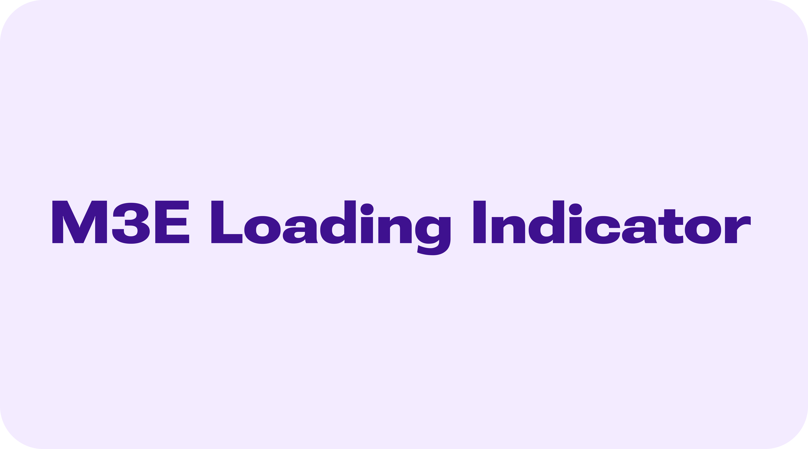

# M3E Loading Indicator



A Flutter package providing Material 3 Expressive (M3E) shape morphing loading indicators and spring-driven pull-to-refresh indicators. It enables smooth vector path interpolation/morphing between various geometric shapes, optional decorative background containers, and physics-based pull-to-refresh interactions.

> [!NOTE]
> `m3e_loading_indicator` is a part of the larger **[m3e_core](https://github.com/Mudit200408/m3e_core)** ecosystem.

---

## 🎮 Interactive Demo

You can try out the package UI demo here: [m3e_core demo](https://mudit200408.github.io/m3e_core/)

---

## 🚀 Features

- **Smooth Shape Morphing** — High-performance smooth shape morphing and vector path interpolation between geometric shapes.
- **Preset Sequences** — Built-in preset morph sequences including Clover & Flower, Starburst & Boom, and Basic Geometry loops.
- **Contained Loading Indicators** — Enclose loading indicators in custom-styled containers with customized background color, indicator color, and corner radius.
- **Deterministic Progress Support** — Supply an explicit `progress` or `value` (`0.0` to `1.0`) to morph deterministically according to actual task progress.
- **M3E Pull-to-Refresh Indicator** — Spring-driven pull-to-refresh header that smoothly pushes scrollable content down and snaps back with expressive spring physics upon release.
- **Programmatic Control** — Observe drag fraction and programmatically trigger refreshes with `M3EPullToRefreshController`.
- **Custom Motion & Haptics** — Spring physics customization with `M3EMotion` presets and haptic feedback triggers with `M3EHapticFeedback`.

---

## 📦 Installation

Add the package to your `pubspec.yaml`:

```yaml
dependencies:
  m3e_loading_indicator: ^0.0.2
```

Import it in your Dart code:

```dart
import 'package:m3e_loading_indicator/m3e_loading_indicator.dart';
```

---

## 🧩 Quick Start

### 1. Default Loading Indicator

A standard Material 3 Expressive loading indicator with default morph loop:

```dart
const M3ELoadingIndicator()
```

### 2. Custom Morph Sequence & Deterministic Value

A loading indicator morphing between custom geometric shapes driven by deterministic progress:

```dart
M3ELoadingIndicator(
  color: Colors.amber,
  value: 0.75, // 0.0 to 1.0 (or null for continuous animation)
  shapes: const [
    Shapes.circle,
    Shapes.triangle,
    Shapes.square,
    Shapes.pentagon,
  ],
)
```

### 3. Contained Loading Indicator

A loading indicator enclosed within a customized container:

```dart
M3EContainedLoadingIndicator(
  width: 80.0,
  height: 80.0,
  padding: const EdgeInsets.all(8.0),
  containerColor: Theme.of(context).colorScheme.tertiaryContainer,
  indicatorColor: Theme.of(context).colorScheme.onTertiaryContainer,
  shapes: const [
    Shapes.heart,
    Shapes.bun,
    Shapes.ghostish,
  ],
)
```

### 4. M3E Pull to Refresh Indicator

A spring-physics pull-to-refresh wrapping any scrollable view:

```dart
M3EPullToRefreshIndicator(
  onRefresh: () async {
    await fetchData();
  },
  child: ListView.builder(
    physics: const AlwaysScrollableScrollPhysics(),
    itemCount: items.length,
    itemBuilder: (context, index) => ListTile(title: Text(items[index])),
  ),
)
```

### 5. Pull to Refresh with Controller & Custom Style

```dart
final controller = M3EPullToRefreshController();

M3EPullToRefreshIndicator(
  controller: controller,
  triggerDistance: 90.0,
  style: const M3EPullToRefreshStyle(
    containerColor: Colors.deepPurple,
    indicatorColor: Colors.white,
    elevation: 4.0,
    springMotion: M3EMotion.expressiveSpatialFast,
    hapticFeedback: M3EHapticFeedback.medium,
  ),
  onRefresh: () async {
    await refreshData();
  },
  child: ListView(
    physics: const AlwaysScrollableScrollPhysics(),
    children: const [ListTile(title: Text('Pull me!'))],
  ),
)

// Programmatically trigger refresh from anywhere:
await controller.refresh();
```

---

## 📖 Detailed API Guide

### 1. `M3ELoadingIndicator`

| Parameter | Type | Default | Description |
|---|---|---|---|
| `shapes` | `List<Shapes>?` | Preset sequence | List of shapes to morph sequentially (min 2). |
| `color` | `Color?` | Theme active | Color of the morphing indicator. |
| `value` | `double?` | `null` | Deterministic progress between `0.0` and `1.0`. When `null`, loops continuously. |
| `constraints` | `BoxConstraints?` | `48.0` width/height | Minimum and maximum layout constraints. |
| `semanticsLabel` | `String?` | `null` | Accessibility label. |
| `semanticsValue` | `String?` | `null` | Accessibility value. |

---

### 2. `M3EContainedLoadingIndicator`

| Parameter | Type | Default | Description |
|---|---|---|---|
| `shapes` | `List<Shapes>?` | Preset sequence | List of shapes to morph sequentially. |
| `padding` | `EdgeInsetsGeometry?` | `EdgeInsets.all(8.0)` | Inner padding around the loading indicator. |
| `width` | `double?` | `null` | Outer width of the container. |
| `height` | `double?` | `null` | Outer height of the container. |
| `containerColor` | `Color?` | `ColorScheme.primaryContainer` | Background color of the container. |
| `indicatorColor` | `Color?` | `ColorScheme.onPrimaryContainer` | Inner indicator color. |
| `borderRadius` | `BorderRadiusGeometry?` | `BorderRadius.circular(9999.0)` | Corner border radius of the container. |
| `progress` | `double?` | `null` | Deterministic progress between `0.0` and `1.0`. |
| `semanticsLabel` | `String?` | `null` | Accessibility label. |
| `semanticsValue` | `String?` | `null` | Accessibility value. |

---

### 3. `M3EPullToRefreshIndicator`

| Parameter | Type | Default | Description |
|---|---|---|---|
| `onRefresh` | `Future<void> Function()` | *Required* | Callback invoked when pull reaches threshold. Header retracts when completed. |
| `child` | `Widget` | *Required* | Scrollable child widget (e.g. `ListView`, `CustomScrollView`). |
| `controller` | `M3EPullToRefreshController?` | `null` | Controller to observe state or trigger refresh programmatically. |
| `indicatorHeight` | `double?` | `70.0` (or style) | Settled height of the header during refresh. |
| `triggerDistance` | `double?` | `80.0` (or style) | Pull distance required to trigger refresh. |
| `springMotion` | `M3EMotion?` | `M3EMotion.expressiveSpatialDefault` | Spring physics preset for retraction animation. |
| `shapes` | `List<Shapes>?` | Default sequence | Custom polygon shapes for morphing indicator. |
| `indicatorIcon` | `Widget?` | `null` | Custom widget to display in place of the default contained loading indicator. |
| `indicatorBuilder` | `Widget Function(BuildContext, double, bool)?` | `null` | Custom builder for full control over header rendering given progress and refresh state. |
| `hapticFeedback` | `M3EHapticFeedback?` | `M3EHapticFeedback.medium` | Haptic feedback triggered on crossing threshold. |
| `style` | `M3EPullToRefreshStyle?` | `null` | Central style configuration for container color, elevation, radii, etc. |
| `dragResistance` | `double?` | `0.55` | Resistance multiplier applied to drag deltas (`0.0` to `1.0`). |
| `maxDragMultiplier` | `double?` | `1.8` | Maximum drag distance multiplier relative to trigger distance. |
| `edgeOffset` | `double` | `0.0` | Vertical offset applied to header (e.g. below floating AppBars). |

---

### 4. `M3EPullToRefreshController`

| Member | Type | Description |
|---|---|---|
| `distanceFraction` | `double` | Drag progress percentage (`0.0` = idle, `1.0` = threshold, `> 1.0` = overshoot). |
| `isRefreshing` | `bool` | Whether refresh callback is currently executing. |
| `isAnimating` | `bool` | Whether the spring retract animation is in progress. |
| `refresh()` | `Future<void>` | Programmatically opens header and triggers `onRefresh`. |

---

## 🎨 Motion Presets (`M3EMotion`)

| Preset | Stiffness | Damping | Use Case |
|---|---|---|---|
| `M3EMotion.expressiveSpatialFast` | `800` | `0.6` | Snappy, bouncy spatial animations |
| `M3EMotion.expressiveSpatialDefault` | `380` | `0.8` | Balanced, expressive spatial spring |
| `M3EMotion.expressiveSpatialSlow` | `200` | `0.8` | Dramatic, bouncy spring |
| `M3EMotion.standardSpatialFast` | `1400` | `0.9` | Snappy, minimal overshoot |
| `M3EMotion.standardSpatialDefault` | `700` | `0.9` | Standard balanced spatial motion |
| `M3EMotion.standardSpatialSlow` | `300` | `0.9` | Relaxed spatial motion |
| `M3EMotion.custom(stiffness, damping)` | Custom | Custom | Custom spring physics |

---

## Credits

This package is inspired by and derived from the excellent **[expressive_loading_indicator](https://pub.dev/packages/expressive_loading_indicator)** package by Tamim Arafat. It has been adapted and extended as part of the M3E ecosystem.

---

## 🐞 Found a bug? or ✨ You have a Feature Request?

Feel free to open an [Issue](https://github.com/Mudit200408/m3e_loading_indicator/issues) or [Contribute](https://github.com/Mudit200408/m3e_loading_indicator/pulls) to the project.

Hope You Love It!

---

### Radhe Radhe 🙏
